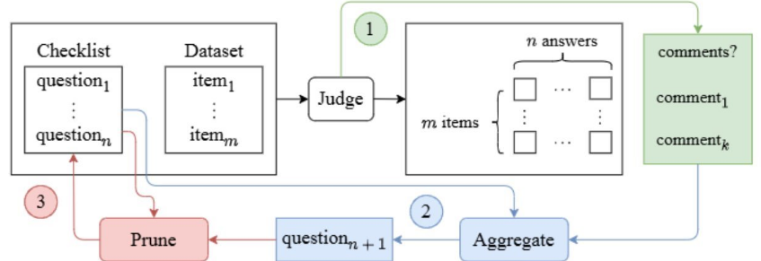

# AutoChecklist
Generate checklist for evaluation on textual data!

This project uses LLMs to generate checklist and evaluated responses for evaluation on any dataset.

## Setup

First, install Python 3+. Then create a Python virtual environment and install the required packages. From the root of the `AutoChecklist` directory run the following commands:

```powershell
python -m venv .venv
.venv/Scripts/Activate.ps1
pip install -r requirements.txt
```

## Generate Checklist and Evaluated annotations

Open VSCode and select the Virtual Environment (AutoChecklist/.venv/) directory as the Python interpretor. ([More details...](https://code.visualstudio.com/docs/python/environments#_working-with-python-interpreters))

Go over the `example.ipynb` with step-by-step instructions on 
1. formatting the dataset (ensuring dataset stored in 'input' parameter of jsonl file), 
2. running pipeline to generate checklist (you can modify checklist, if  you want) and 
3. annotate responses for evaluation of your scenario.

## Overview
Here is the pipeline overview of how the AutoChecklist works:

Goal is to improve automatic evaluations happening throughout Microsoft.

For this we replicate the means of how a human would manually put in efforts to evaluate on a task for a new benchmark and translate that to LLM automating the task for us. We adapt the complex task of subjective evaluation to concrete, interpretable objective checklists and leverage that for annotating the scores.
We do this by letting the LLM leave comments about anything that it deems out of the ordinary and use these comments to automatically update the original checklist. 